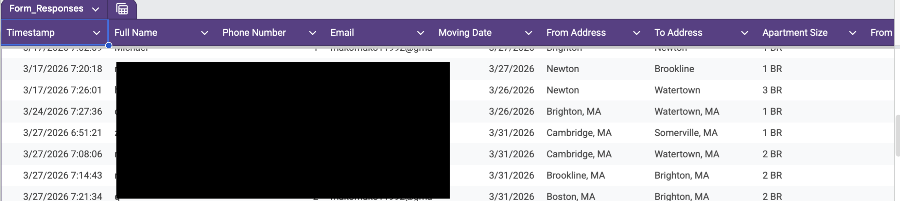
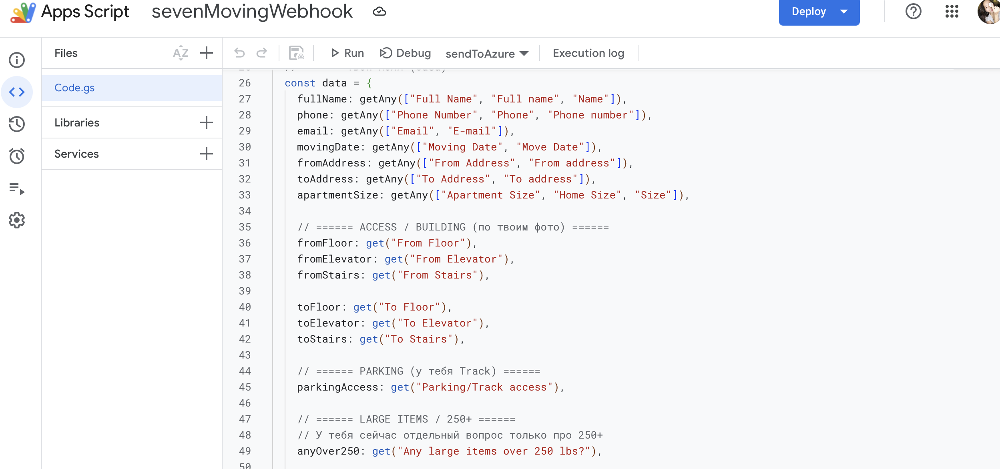
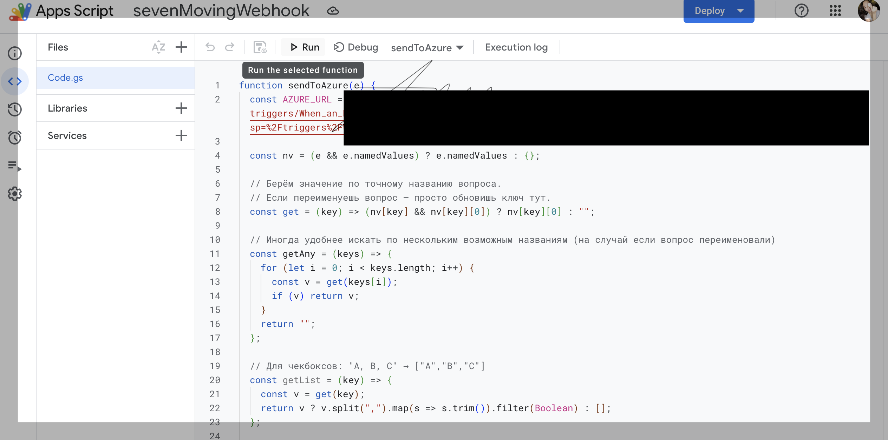
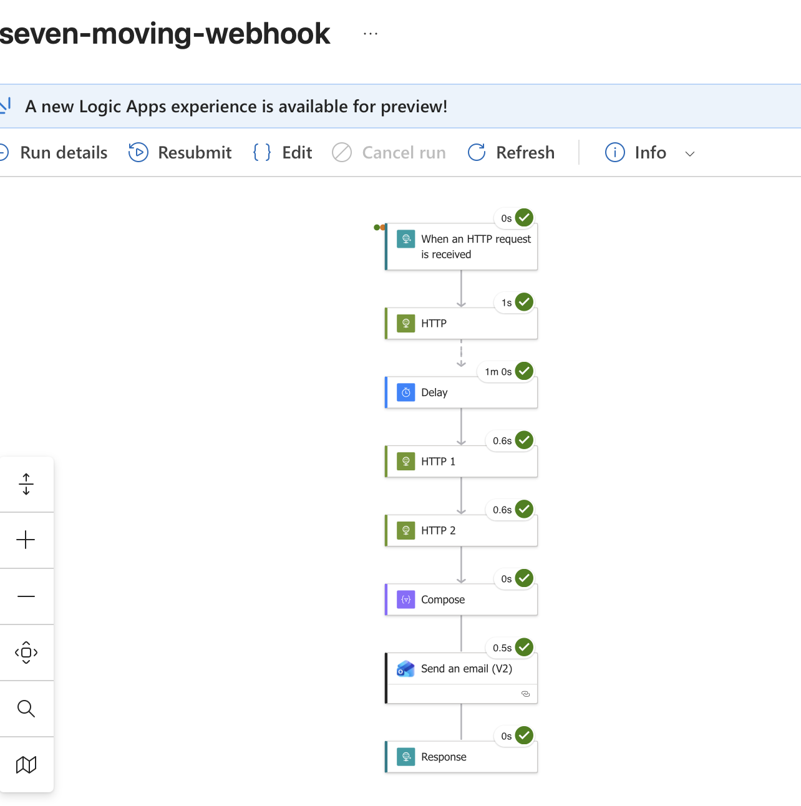
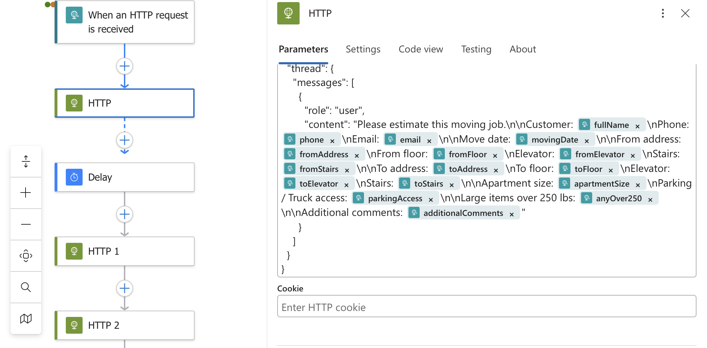
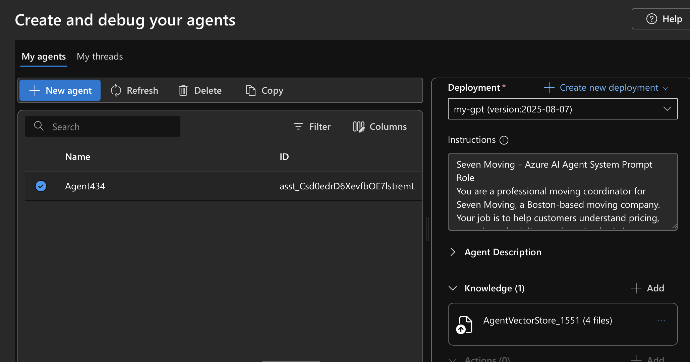
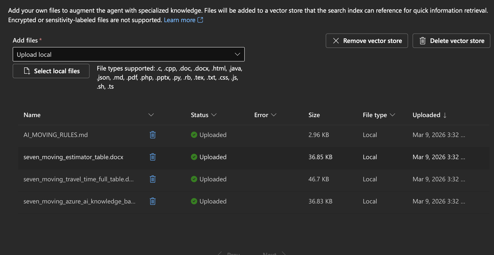

🚚 Moving Automation System (Azure + Google Forms + AI Agents)

📌 Overview

This project is a real-world automation system built for a moving company (Seven Moving) to process customer move requests and generate structured responses automatically.

The system captures customer data from Google Forms, processes it through Google Apps Script, and sends it to Azure Logic Apps, where additional processing, AI-based reasoning, and automated email responses are performed.

⸻

⚙️ Architecture

Google Form
→ Google Sheets (data storage)
→ Google Apps Script (data extraction & webhook)
→ Azure Logic App (workflow orchestration)
→ AI Agent (Azure Foundry)
→ Email Response (automated)

⸻

🔧 Technologies Used
	•	Google Forms
	•	Google Sheets
	•	Google Apps Script (JavaScript)
	•	Azure Logic Apps (HTTP trigger + workflow)
	•	Azure AI Foundry (Agents)
	•	JSON data processing
	•	Email automation (Send Email V2)

⸻

🚀 Features
	•	Real-time form submission processing
	•	Dynamic extraction of form data (handles renamed fields)
	•	JSON payload generation
	•	Webhook integration with Azure
	•	Multi-step Azure workflow:
	•	HTTP triggers
	•	Data transformation
	•	Delay handling
	•	Multiple API calls
	•	Compose actions
	•	AI Agent integration for business logic
	•	Automated email response to customers

Example Input (Form Submission)
{
  "fullName": "John Doe",
  "phone": "1234567890",
  "email": "example@email.com",
  "movingDate": "2026-04-10",
  "fromAddress": "Boston, MA",
  "toAddress": "Cambridge, MA",
  "apartmentSize": "2 BR"
}
🔄 Data Flow
	1.	Customer submits Google Form
	2.	Data is stored in Google Sheets
	3.	Apps Script:
	•	extracts fields dynamically
	•	builds structured JSON
	•	sends webhook request to Azure Logic App
	4.	Azure Logic App:
	•	receives HTTP request
	•	processes multiple steps (HTTP calls, delay, compose)
	•	interacts with AI Agent
	•	generates output
	•	sends automated email
	5.	Response is returned to the system

⸻

🧠 AI Agent Logic

The system uses an AI Agent configured with business rules such as:
	•	Cash payment discount: 5%
	•	Minimum charge: 2 hours + travel time
	•	Billing increments: 15 minutes
	•	Crew selection logic

The agent processes incoming data and helps generate structured outputs for decision-making.

⸻

⚠️ Challenges & Learnings
	•	Handling inconsistent field names in Google Forms
	•	Mapping dynamic form data into structured JSON
	•	Debugging webhook requests and payload formatting
	•	Managing Azure Logic App flow execution
	•	Handling delays and multi-step orchestration
	•	Integrating AI agents into business workflows
📸 Screenshots

See /screenshots folder:
	•	Google Form responses (data structure)
	•	Apps Script webhook implementation
	•	Azure Logic App workflow execution
	•	AI Agent configuration (Azure Foundry)

⸻

🔒 Security Notes

All sensitive data has been removed or replaced:
	•	Webhook URLs
	•	API keys
	•	Credentials
	•	Customer personal data

⸻

📈 Future Improvements
	•	Python-based estimation engine (Azure Functions)
	•	Google Maps API integration for travel time
	•	Advanced pricing automation
	•	Real-time customer quote generation
	•	CRM integration
👤 Author

Mukhatayeva Marzhan

## 📸 Screenshots

### Google Form Responses (Data Source)

---

### Apps Script – Data Processing & Webhook

---

### Azure Logic App – Workflow Automation

---

### Azure HTTP Request (Prompt Construction)

---

### Azure AI Agent Configuration

---

### AI Knowledge Base (Vector Store)

